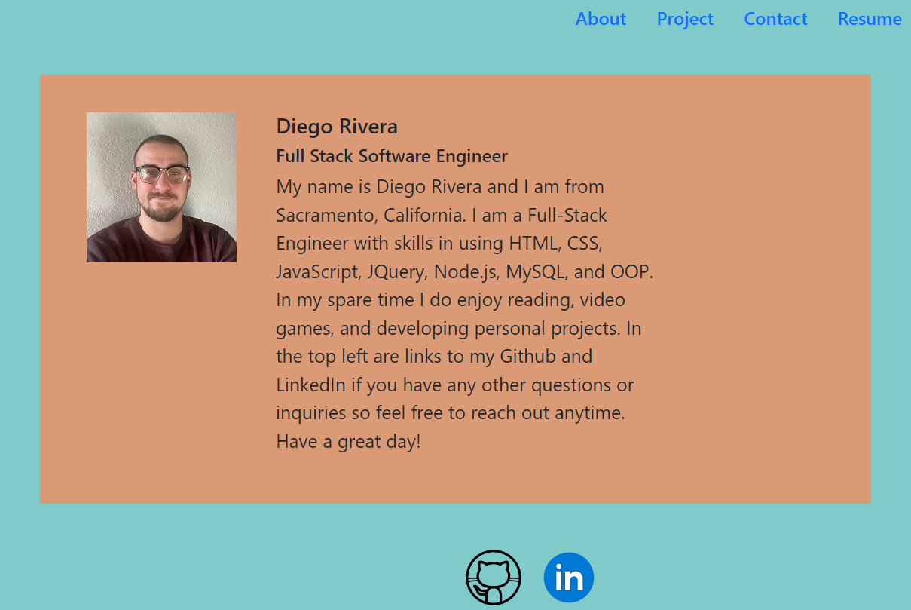

# Portfolio-React

  ## Description
  This is a new and improved Portfolio that uses React.js to allow for multiple pages and more functionality. 
   
  Live URL: https://diegorivera1110.github.io/portfolio-react/
   
  

  ## Table of Contents
  - [Installation](#installation)
  - [Usage](#usage)
  - [Credits](#credits)
  - [License](#license)
  - [Tests](#tests)
  - [Questions](#questions)

  ## Installation
  once this repository has been cloned all you have to do is run `npm install` in the terminal at the root of the repository and once everything is downloaded run `npm start` and it will open up in the browser.

  ## Usage
  This new portfolio was created to show my understanding and usage of React.js also allowing me to improve on my portfolio.

  ## Credits
  Diego Rivera

  ## License
   
  To read more on the license, [The MIT License](https://opensource.org/licenses/MIT)

  ## Tests
  N/A
  
  # Questions

  ## GitHub: 
  Account Name: diegorivera1110  
  Link: https://github.com/Diegorivera1110

  ## Email Address: 
  diegorivera1110@gmail.com

